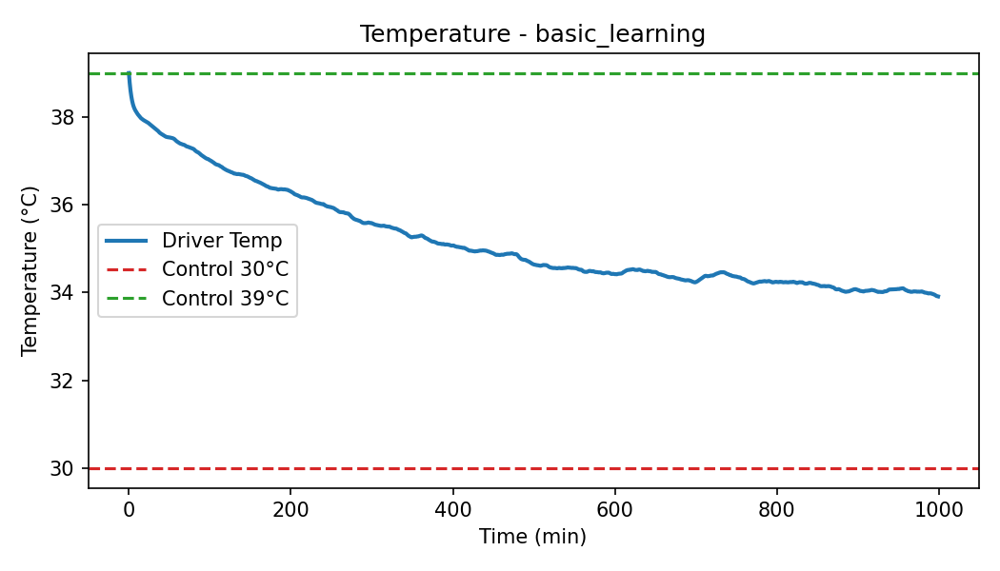
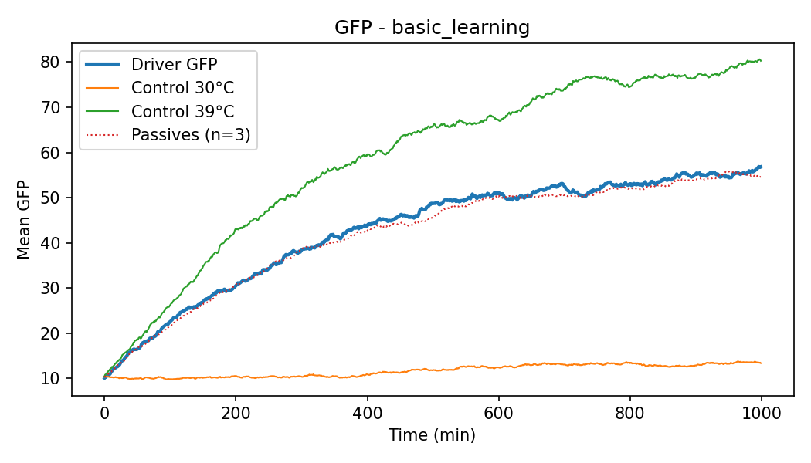
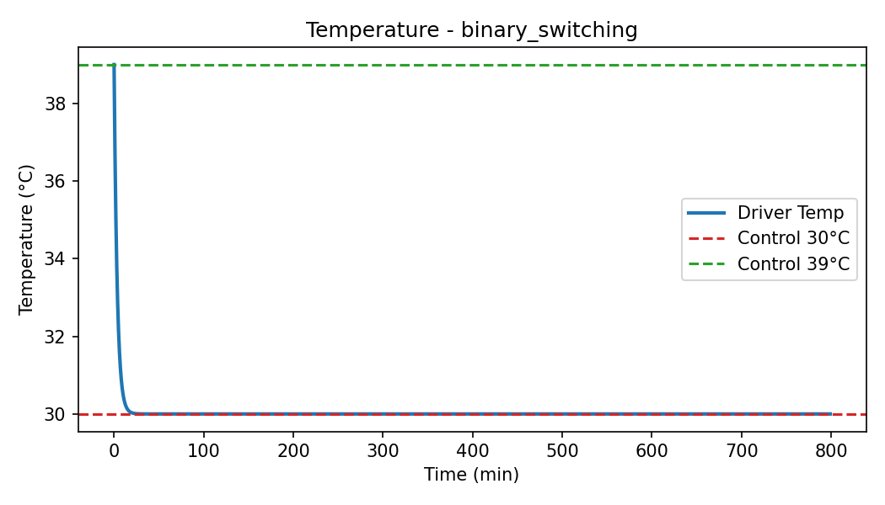
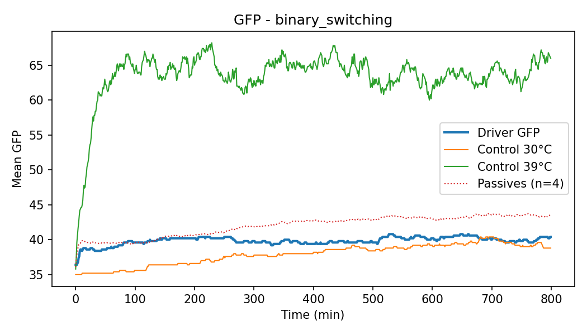
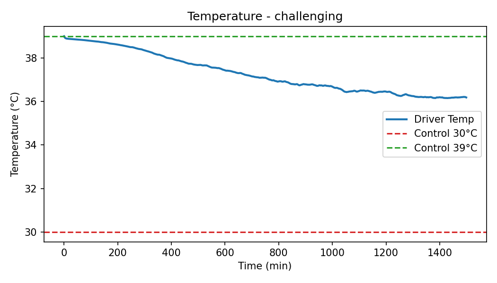
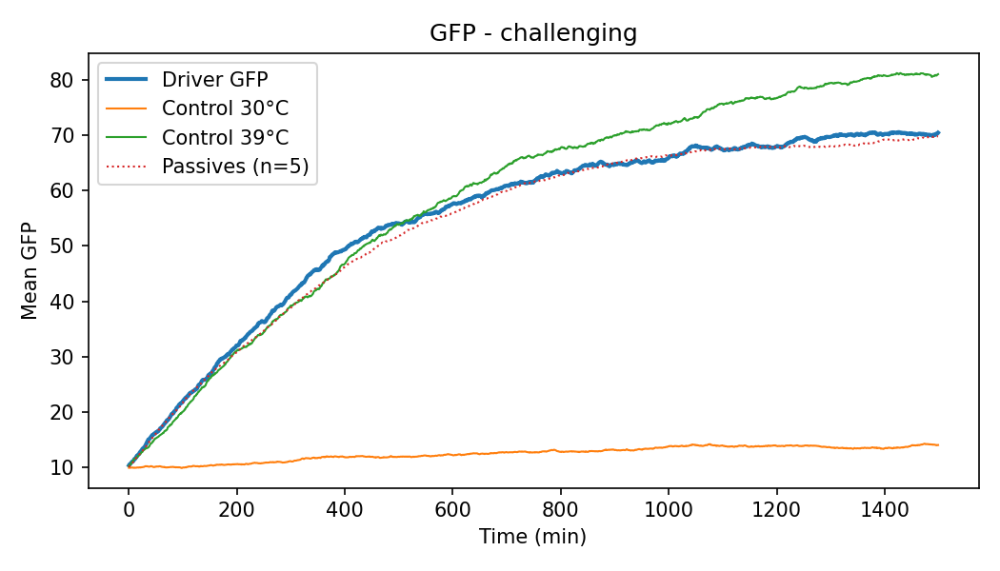
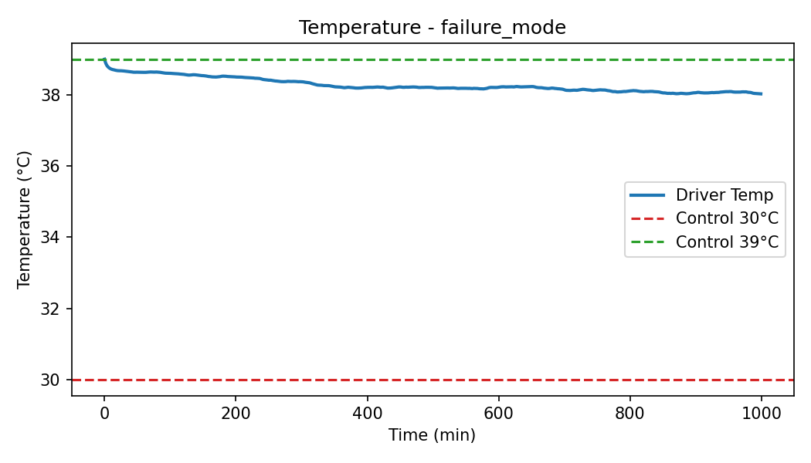
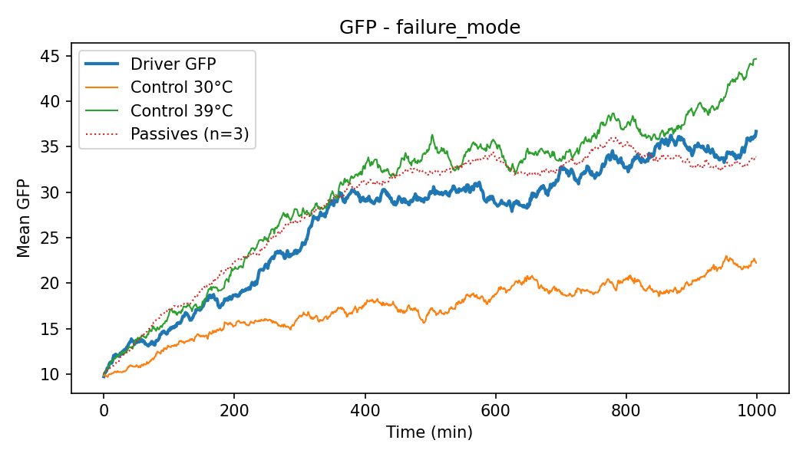
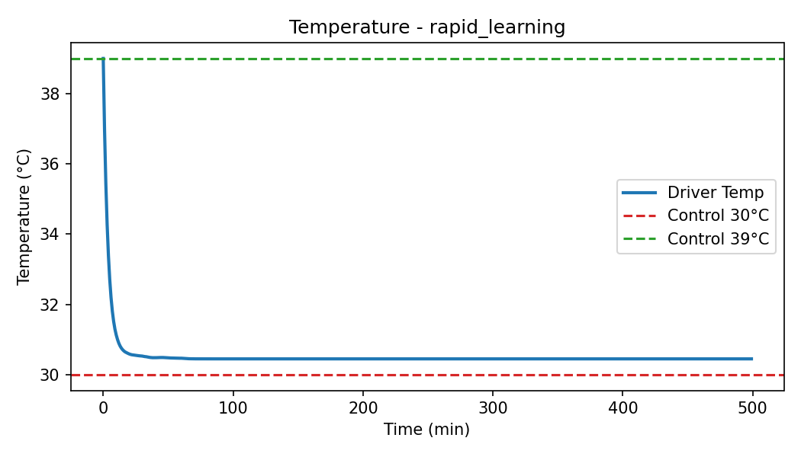
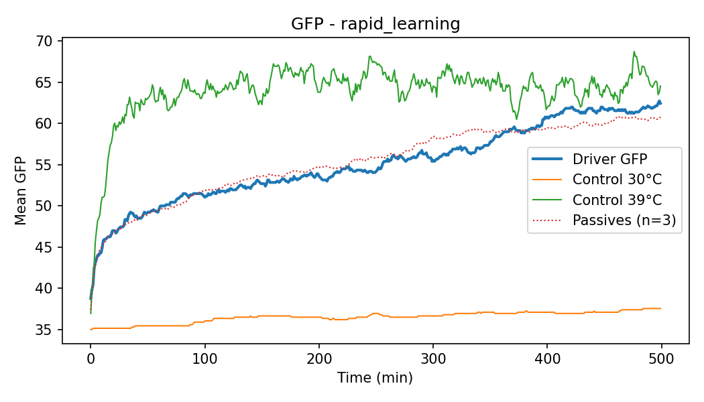

# 🧬 Evolutionary Learning Laboratory (Moran Process)

**Interactive simulation of temperature-feedback–driven adaptation in synthetic yeast populations**

This app models evolutionary “learning” via a **strict Moran (birth–death)** process where each time step performs **exactly one birth and one death**, keeping population size constant. A feedback controller cools the environment as the population’s mean GFP rises. **Control wells are hard-coded to 30°C and 39°C** for the entire run.

---

## 🚀 Quick Start

### Requirements

* Python 3.9–3.11
* macOS/Linux/Windows

### Install & Run

```bash
# Clone
git clone <your-repo>
cd evolutionary-learning

# Install dependencies
pip install -r requirements.txt

# Launch the Streamlit app
streamlit run app.py
```

Then open your browser at `http://localhost:8501`, keep defaults, click **“🚀 Run Evolution Experiment”**, and explore the dashboard.

---

## 📁 Project Structure

```
evolutionary-learning/
├─ app.py                   # Streamlit UI
├─ src/
│  └─ main.py               # Core engine: strict Moran BD, models, utilities
├─ requirements.txt         # Dependencies
└─ README.md                # This guide
```

> The UI imports the engine via `from src.main import ...`.

---

## 🧠 What’s New / Key Behavior

* **Strict Moran updates:** every step = **1 fitness-proportional birth + 1 uniform death**.
* **Controls locked:** 30.0°C and 39.0°C **forever** (no feedback, no smoothing, no startup logic).
* **Driver only uses feedback + inertia:** optional first-minute hold and smoothing.
* **Exports include control temperatures** for easy verification.
* **Generation-time landscape** plot derived from the exact model equations.
* **Metrics burn-in** to ignore early transients.

---

## 🖥️ App Features

* **Driver, Passives, Controls:**

  * **Driver**: experiences temperature set by GFP→Temp feedback.
  * **Passives**: experience the **same temperature** as the driver but **do not influence it**.
  * **Controls**: **30°C** and **39°C** constant every step.
* **Modes:** `continuous` or `binary` GFP expression.
* **Plots:** Temperature & GFP time series, feedback curve vs. trajectory, learning progress, and a generation-time heatmap.
* **Downloads:** CSV time series, JSON parameters + metrics, and raw JSON.

---

## 🎛️ Parameters (UI ranges & effects)

### 🔬 Core Experimental Setup

| UI Control                  | Range (default)                        | Meaning                                     |
| --------------------------- | -------------------------------------- | ------------------------------------------- |
| **GFP Expression Mode**     | `continuous` / `binary` (`continuous`) | Trait model                                 |
| **Simulation Time (min)**   | 200–3000 (**1000**)                    | Total minutes simulated                     |
| **Time Step (min/event)**   | 1–10 (**1**)                           | Minutes per Moran event (1 birth + 1 death) |
| **Population Size (cells)** | 50–800 (**200**)                       | Constant size via Moran BD                  |
| **Number of Passive Wells** | 1–8 (**3**)                            | Passive replicates                          |

### 🌡️ Temperature Feedback (Driver only)

| UI Control               | Range (default)                                       | Notes                                     |
| ------------------------ | ----------------------------------------------------- | ----------------------------------------- |
| **Feedback Function**    | `linear`, `sigmoid`, `step`, `exponential` (`linear`) | GFP→Temp mapping                          |
| **Feedback Sensitivity** | 0.2–4.0 (**1.0**)                                     | Higher → stronger cooling response        |
| **Range**                | **30°C ↔ 39°C** (fixed)                               | Driver operates strictly within this span |

**Feedback function (engine):**

```
temperature = max_temp - cooling_factor * (max_temp - base_temp)
```

with different definitions of `cooling_factor` per mode (linear/sigmoid/step/exponential). Values are clipped to \[30, 39] °C.

### 🧬 Evolution & Fitness

> Internally maps to `GFPParams` (`inherit_sd`, `switch_prob_base`, `cost_strength`, `cost_exponent`)

| UI Control                         | Range (default)       | Effect                                          |
| ---------------------------------- | --------------------- | ----------------------------------------------- |
| **Inheritance Noise (continuous)** | 1.0–20.0 (**5.0**)    | Daughter GFP = mother ± noise (continuous mode) |
| **Stress-Induced Switching Rate**  | 0.001–0.08 (**0.01**) | Per-step, scaled up by heat                     |
| **GFP Metabolic Cost**             | 0.0–1.2 (**0.3**)     | Higher GFP → slower division                    |
| **Cost Function Curvature**        | 0.5–3.0 (**1.5**)     | Nonlinearity of the cost                        |

**Generation time model (per cell):**

* Base vs. temperature:
  `base_time = 60 + 120 * ((T−30)/9)^2` (clipped to 30–39°C → \[0,1])
* Cost multiplier:

  * **Continuous:** `1 + cost_strength * (gfp/100)^cost_exponent`
  * **Binary:** `1.3` if GFP>50 else `1.0`
* **Generation time = base\_time × cost\_multiplier**
* **Fitness ∝ 1/generation\_time**

### 🧊 Smoothing & Metrics (Driver)

| UI Control               | Range (default)          | Notes                                            |
| ------------------------ | ------------------------ | ------------------------------------------------ |
| **Temperature Inertia**  | 0.05–1.0 (**0.25**)      | Smoother changes for lower values                |
| **Start at Max Temp**    | toggle (**True**)        | First step holds 39°C; otherwise start at target |
| **Metric Burn-in (min)** | 0–max(100, T/3) (**10**) | Ignore early window in metric calculations       |

### ⚙️ Advanced

| UI Control                  | Range (default)   | Notes                                             |
| --------------------------- | ----------------- | ------------------------------------------------- |
| **Random Seed**             | 1–999999 (**42**) | Reproducibility                                   |
| **Show Parameter Warnings** | toggle (On)       | Validation hints (e.g., sensitivity too low/high) |

---

## 📊 Metrics (what the app reports)

From `calculate_learning_metrics`:

* **learning\_score**: Normalized cooling from initial temp toward 30°C (0–1).
* **final\_gfp**: Driver’s mean GFP at the end.
* **final\_temperature**: Driver’s last temperature.
* **adaptation\_time**: First time (after burn-in) that temperature crosses halfway between initial and final.
* **establishment\_time**: First time (after burn-in) high-GFP fraction ≥ 0.5.
* **temperature\_stability**: 1 / (1 + variance) over the last 20% of temps.
* **final\_high\_gfp\_fraction**: Fraction of cells above threshold (binary: >50; continuous: >60).

**Quick interpretation**

* **Learning Score > 0.7** → strong adaptation
* **0.3–0.7** → moderate
* **< 0.3** → weak

--- 

## 📐 How Metrics Are Calculated

Metrics are computed in `calculate_learning_metrics` (see `src/main.py`) and summarize the driver well’s adaptation. Here is how each key variable is derived:

* **`learning_score`**
  Measures how much the driver cooled relative to its starting temperature.

  $$
  \text{learning\_score} = \frac{\text{initial\_temp} - \text{final\_temp}}{\max(\text{initial\_temp} - 30.0,\; 1\text{e-9})}
  $$

  Normalized between **0 (no cooling)** and **1 (full cooling to 30°C)**.

* **`final_gfp`**
  The driver’s **mean GFP value at the last time step**.

* **`final_temperature`**
  The driver’s **last recorded temperature** in the simulation.

* **`adaptation_time`**
  The **first time (after burn-in)** that the driver’s temperature drops below the halfway point between its initial and final temperature:

  $$
  T_{\text{mid}} = \text{initial\_temp} - 0.5 \times (\text{initial\_temp} - \text{final\_temp})
  $$

  The earliest time where $T(t) \leq T_{\text{mid}}$ is reported.

* **`establishment_time`**
  The **first time (after burn-in)** that the driver’s high-GFP fraction reaches or exceeds 0.5 (≥50% of cells above threshold).

* **`temperature_stability`**
  Computed as:

  $$
  \text{temperature\_stability} = \frac{1}{1 + \mathrm{Var}(T_{\text{last 20\%}})}
  $$

  A value closer to **1** indicates more stable temperatures in the final phase.

* **`final_high_gfp_fraction`**
  The **fraction of driver cells** at the last time step with GFP above threshold:

  * continuous mode → GFP > 60
  * binary mode → GFP > 50.


---

## 🧪 Recommended Protocols

### 🟢 Basic Learning (Beginner)

* **Mode:** continuous
* **Time:** 1000 min, **Pop:** 200, **Passives:** 3
* **Feedback:** linear, **Sensitivity:** 1.0
* **Evolution:** noise 5.0, switch 0.01, cost 0.3, curvature 1.5
  **Expect:** Cooling into low 30s °C, learning\_score ≳ 0.6

### 🟡 Binary Switching (Intermediate)

* **Mode:** binary
* **Time:** 800 min, **Pop:** 300, **Passives:** 4
* **Feedback:** step, **Sensitivity:** 1.5
* **Evolution:** (inheritance noise not crucial), switch 0.02, cost 0.4, curvature 1.0
  **Expect:** Rapid transition, learning\_score ≳ 0.7

### 🔴 Challenging Conditions (Advanced)

* **Mode:** continuous
* **Time:** 1500 min, **Pop:** 500, **Passives:** 5
* **Feedback:** sigmoid, **Sensitivity:** 0.6
* **Evolution:** noise 8.0, switch 0.008, cost 0.5, curvature 2.0
  **Expect:** Slower adaptation, learning\_score ≈ 0.3–0.6

### 🔵 Failure Mode Analysis

* **Mode:** continuous
* **Time:** 1000 min, **Pop:** 150, **Passives:** 3
* **Feedback:** linear, **Sensitivity:** 0.3
* **Evolution:** noise 15.0, switch 0.003, cost 0.8, curvature 2.5
  **Expect:** Likely failure (score < 0.3). Great for sensitivity analysis.

### ⚡ Rapid Learning (Expert)

* **Mode:** binary
* **Time:** 500 min, **Pop:** 400, **Passives:** 3
* **Feedback:** exponential, **Sensitivity:** 2.0
* **Evolution:** noise 1.0, switch 0.04, cost 0.2, curvature 1.0
  **Expect:** Very fast adaptation (score > 0.8), short adaptation\_time.

---

## 📥 Data Export

* **CSV (Time Series):** driver/passives/controls GFP, driver temp, control temps (for constant-temp verification), high-GFP fractions, population size.
* **JSON (Parameters & Metrics):** full simulation and GFP params + summary metrics.
* **JSON (Raw):** complete per-well histories and final distributions.

---

## 🔍 Troubleshooting & Validation

The app warns when parameters are likely problematic:

* **Very low sensitivity** → “may prevent learning”
* **Very high sensitivity** → “may cause instability”
* **High GFP cost or switching** → noise/slow growth
* **Small populations or short runs** → drift/under-adaptation
* **temp\_inertia outside (0,1]** → invalid

**Remember:** Only the **driver** uses feedback + inertia. **Controls** are **always 30°C** and **39°C**; **passives** simply **follow the driver temperature** with no influence.

---

## 🔬 Tips for Study Design

* Compare **binary vs. continuous** under the same settings.
* Sweep **sensitivity** (0.2, 0.5, 1.0, 1.5, 2.0, 4.0).
* Vary **population size** (100–800) for drift effects.
* Run **replicates** with different **random\_seed** values and aggregate.
* Use **metric\_burn\_in** (e.g., 10–100 min) to avoid startup artefacts.

---

## 🧪 CLI Smoke Test (optional)

The core module includes a simple test in `src/main.py`:

```bash
python -m src.main
```

It runs a short binary-mode simulation and prints key metrics.

---

## 📜 License & Citation

* Choose an open-source license appropriate for your project.
* If you use this in a publication, please cite the repository and include the **strict Moran** and **fixed-controls** details.

---

**Happy experimenting!** If you have questions or want to collaborate, open an issue or reach out.
*Last Updated: 2025 • Status: Active*

---

## 🧾 Results interpretation: current behavior vs. reality

### Your observed outcomes (from the app)
- The 39 °C control reaches and maintains the highest GFP.
- The feedback “driver” well looks similar to the “passive” wells (they experience the same temperature trajectory; passives don’t influence it).
- The 30 °C control remains lowest GFP.

### Why the current model produces this
This app uses a strict Moran process (exactly 1 birth + 1 death per step; population fixed). Fitness is inversely related to generation time, and heat increases switching toward high-GFP states. Under these assumptions:
- At constant 39 °C, stress increases switching since we defined a stress-induced high switching rate. If we drop that to zero - all wells get to a very low gfp level.
- The driver and passives share the same temperature each step; passives simply track the driver’s environment without feeding back, plus they are doing the exact same moran process — so their trajectories can be very similar.
- At constant 30 °C, there’s minimal switching of GFP levels, and the generation time is minimal, so GFP stays low.

### Why experiments can differ
Real systems often deviate from strict Moran assumptions and include biophysical effects not modeled here:
- Non-Moran updates: multiple deaths without births (and vice versa), variable population size, batch effects, and asynchronous events.
- Global expression dampening under chronic stress: transcription/translation burdens reduce overall protein levels.
- Heat-accelerated GFP degradation/maturation changes: faster decay or slower proper folding at high temperature can lower steady-state GFP despite selection.
- Additional resource and damage constraints: sustained stress can accumulate damage, lower fitness broadly, or reprioritize expression away from GFP.

### Suggestions for model extensions to better match reality
If we want the 39 °C control to rise then drop (more realistic), we can try these tweaks in the engine:
- Relax strict Moran: decouple birth/death events (allow k deaths without births), or use stochastic rates (e.g., Gillespie-style events) with temperature-dependent death rates.
- Add explicit GFP dynamics: dGFP/dt = production − decay with temperature-dependent decay (and optional maturation delay); reduce production globally under stress.
- Temperature-dependent global cost: scale the cost multiplier up with temperature to reflect broad expression slow-downs.
- Damage/aging state: accumulate stress-induced damage that reduces division rate or increases death probability over time at high temperatures.
- Resource limits: impose carrying-capacity or energy budget constraints that penalize sustained high GFP under stress.


--- 
# Batch Summary: Recommended Protocols

This report aggregates metrics and links to plots generated by scripts/run_protocols.py.

## basic_learning

**Key metrics**:

- learning_score: 0.57
- final_gfp: 56.8
- final_temperature: 33.9 °C
- adaptation_time: 167.0
- final_high_gfp_fraction: 0.47

**Interpretation**:

> Learning score: 0.57; Final temp: 33.9°C; Final driver GFP: 56.8
> Driver cooled substantially; indicates good feedback-driven adaptation.
> 39°C control > 30°C control, consistent with heat-induced switching/selection.





---

## binary_switching

**Key metrics**:

- learning_score: 1.00
- final_gfp: 40.4
- final_temperature: 30.0 °C
- adaptation_time: 10.0
- final_high_gfp_fraction: 0.09

**Interpretation**:

> Learning score: 1.00; Final temp: 30.0°C; Final driver GFP: 40.4
> Driver cooled substantially; indicates good feedback-driven adaptation.
> 39°C control > 30°C control, consistent with heat-induced switching/selection.





---

## challenging

**Key metrics**:

- learning_score: 0.31
- final_gfp: 70.4
- final_temperature: 36.2 °C
- adaptation_time: 544.0
- final_high_gfp_fraction: 0.70

**Interpretation**:

> Learning score: 0.31; Final temp: 36.2°C; Final driver GFP: 70.4
> Moderate cooling; parameters allow some adaptation but not strong.
> 39°C control > 30°C control, consistent with heat-induced switching/selection.





---

## failure_mode

**Key metrics**:

- learning_score: 0.11
- final_gfp: 36.7
- final_temperature: 38.0 °C
- adaptation_time: 161.0
- final_high_gfp_fraction: 0.18

**Interpretation**:

> Learning score: 0.11; Final temp: 38.0°C; Final driver GFP: 36.7
> Weak/no cooling; likely low sensitivity or high cost/noise.
> 39°C control > 30°C control, consistent with heat-induced switching/selection.





---

## rapid_learning

**Key metrics**:

- learning_score: 0.95
- final_gfp: 62.5
- final_temperature: 30.4 °C
- adaptation_time: 10.0
- final_high_gfp_fraction: 0.46

**Interpretation**:

> Learning score: 0.95; Final temp: 30.4°C; Final driver GFP: 62.5
> Driver cooled substantially; indicates good feedback-driven adaptation.
> 39°C control > 30°C control, consistent with heat-induced switching/selection.





---
