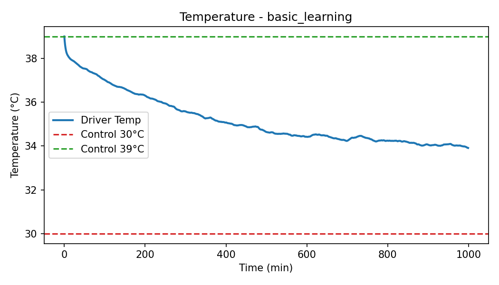
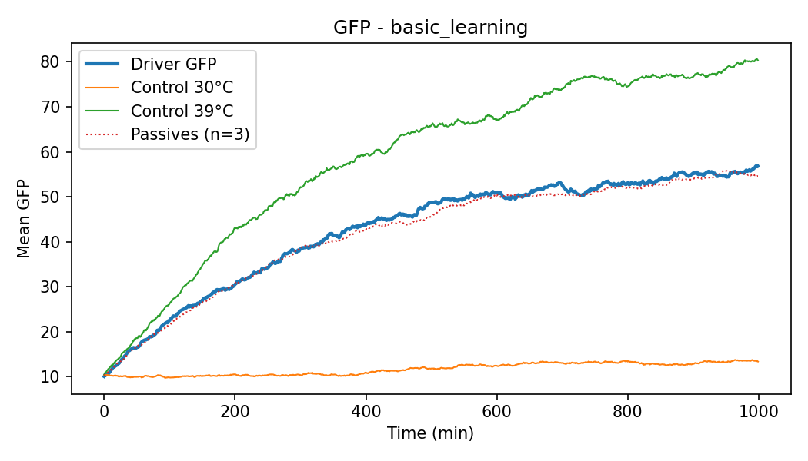
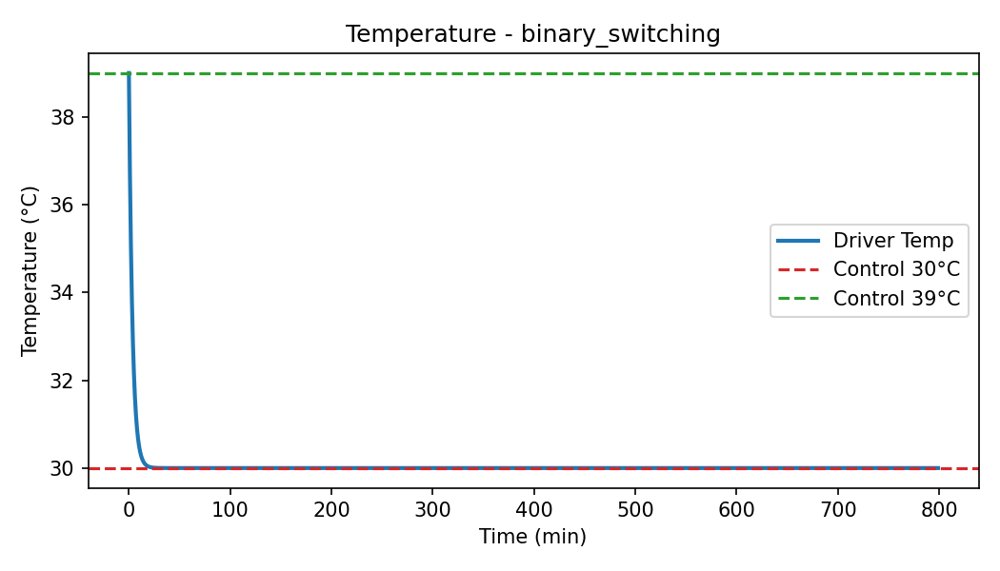
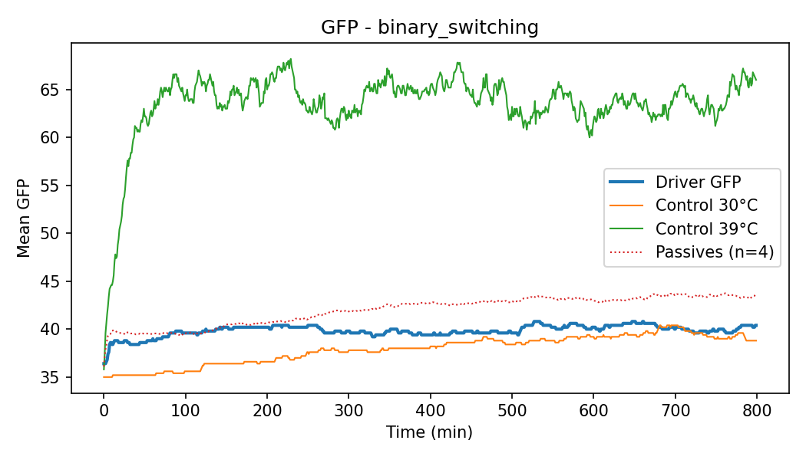
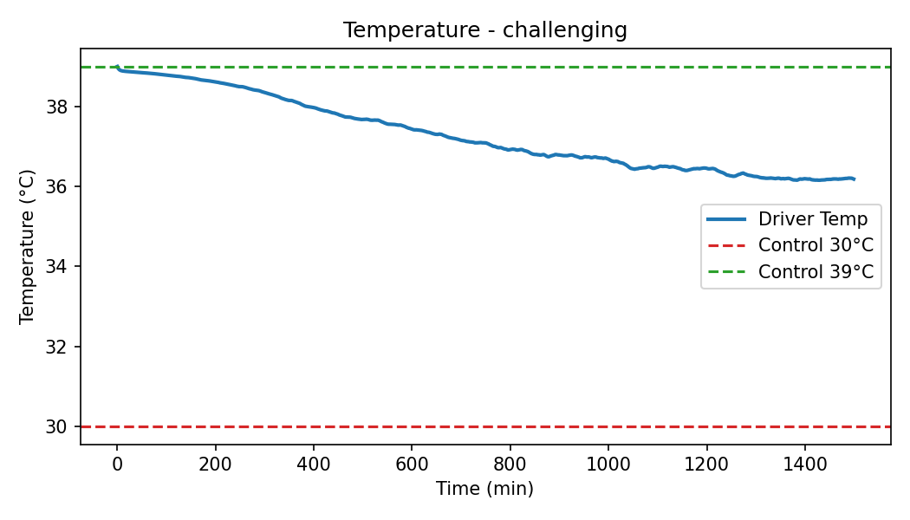
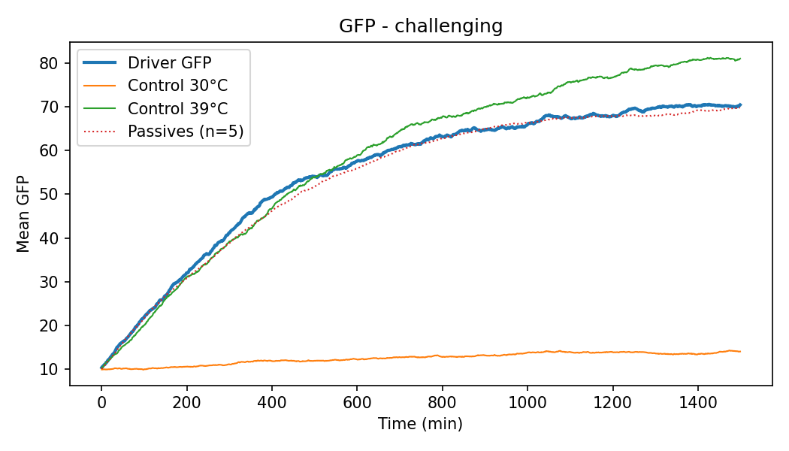
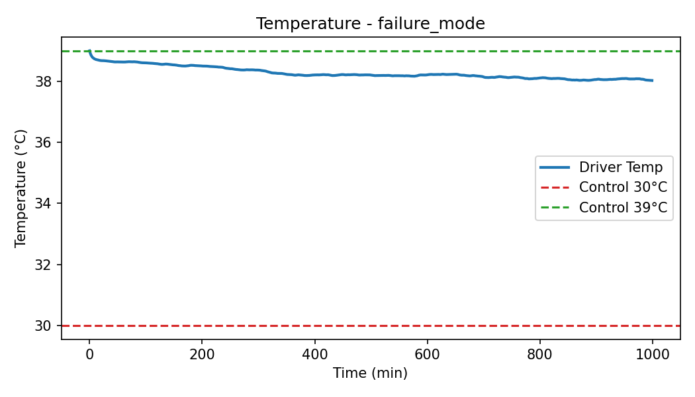
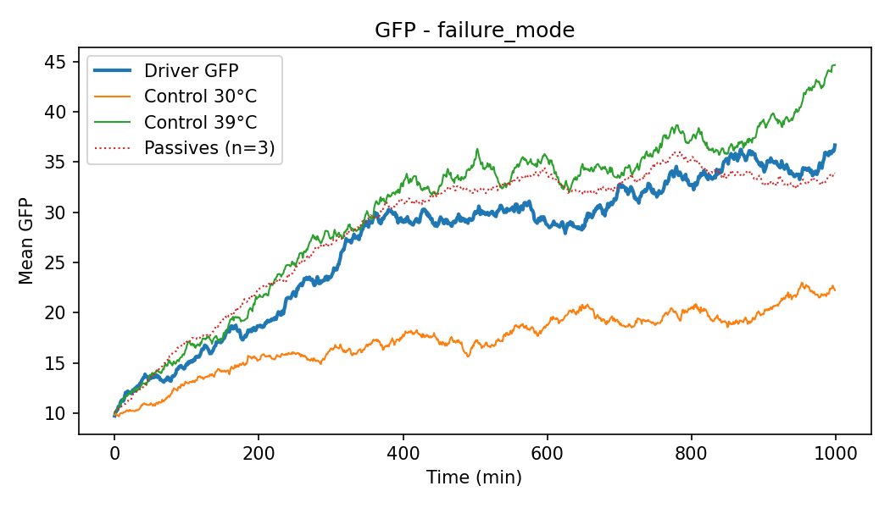
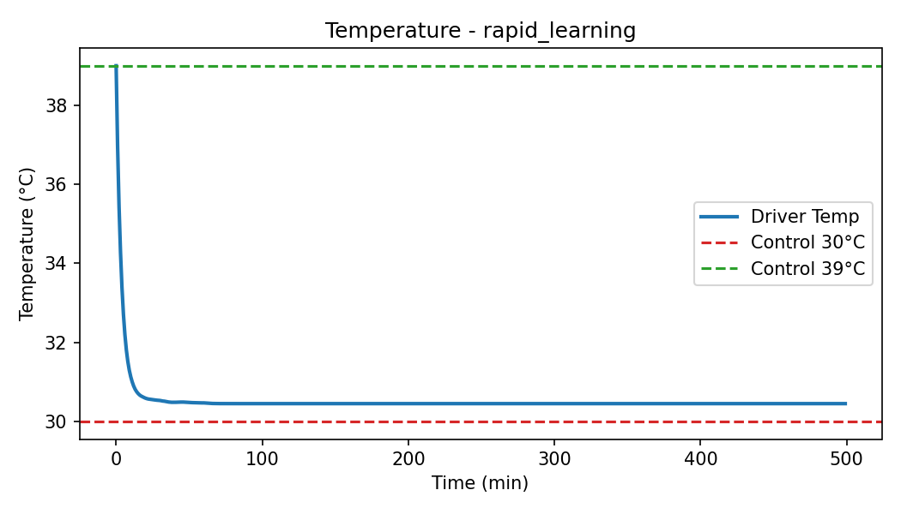
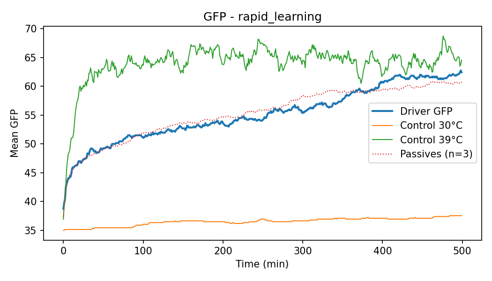

# Batch Summary: Recommended Protocols

This report aggregates metrics and links to plots generated by scripts/run_protocols.py.

## basic_learning

**Key metrics**:

- learning_score: 0.57
- final_gfp: 56.8
- final_temperature: 33.9 °C
- adaptation_time: 167.0
- final_high_gfp_fraction: 0.47

**Interpretation**:

> Learning score: 0.57; Final temp: 33.9°C; Final driver GFP: 56.8
> Driver cooled substantially; indicates good feedback-driven adaptation.
> 39°C control > 30°C control, consistent with heat-induced switching/selection.

---

## binary_switching

**Key metrics**:

- learning_score: 1.00
- final_gfp: 40.4
- final_temperature: 30.0 °C
- adaptation_time: 10.0
- final_high_gfp_fraction: 0.09

**Interpretation**:

> Learning score: 1.00; Final temp: 30.0°C; Final driver GFP: 40.4
> Driver cooled substantially; indicates good feedback-driven adaptation.
> 39°C control > 30°C control, consistent with heat-induced switching/selection.

---

## challenging

**Key metrics**:

- learning_score: 0.31
- final_gfp: 70.4
- final_temperature: 36.2 °C
- adaptation_time: 544.0
- final_high_gfp_fraction: 0.70

**Interpretation**:

> Learning score: 0.31; Final temp: 36.2°C; Final driver GFP: 70.4
> Moderate cooling; parameters allow some adaptation but not strong.
> 39°C control > 30°C control, consistent with heat-induced switching/selection.

---

## failure_mode

**Key metrics**:

- learning_score: 0.11
- final_gfp: 36.7
- final_temperature: 38.0 °C
- adaptation_time: 161.0
- final_high_gfp_fraction: 0.18

**Interpretation**:

> Learning score: 0.11; Final temp: 38.0°C; Final driver GFP: 36.7
> Weak/no cooling; likely low sensitivity or high cost/noise.
> 39°C control > 30°C control, consistent with heat-induced switching/selection.

---

## rapid_learning

**Key metrics**:

- learning_score: 0.95
- final_gfp: 62.5
- final_temperature: 30.4 °C
- adaptation_time: 10.0
- final_high_gfp_fraction: 0.46

**Interpretation**:

> Learning score: 0.95; Final temp: 30.4°C; Final driver GFP: 62.5
> Driver cooled substantially; indicates good feedback-driven adaptation.
> 39°C control > 30°C control, consistent with heat-induced switching/selection.

---
